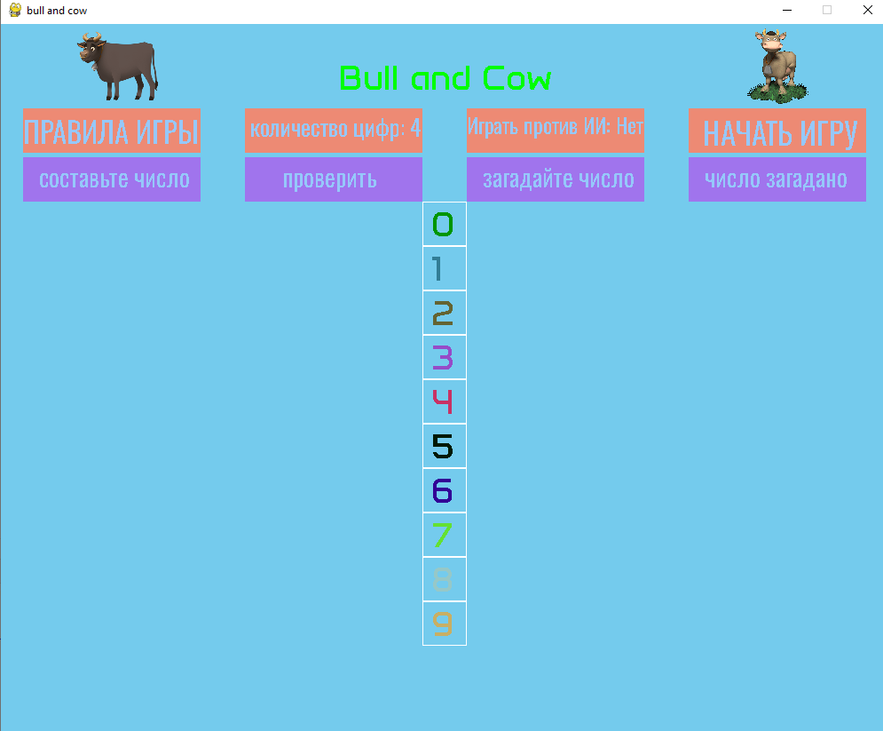

# Быки и коровы

## Авторы: Щербаков Анатолий Александрович

## Задача проекта:
создать удобный интерфейс для игры «Быки и коровы». 

## Что удалось сделать:
### По интерфейсу:
пользователю не надо забивать цифры для ввода своей комбинации. Достаточно кликнуть по нужной цифре, а затем по пустому полю. При этом выбранная цифра исчезает из поля выбираемых цифр, что исключает появление повторных цифр. 

### Дополнительные опции:
Реализован режим игры с длинной чисел от 2 до 7. Классический вариант — 4 цифры. 

Также реализован режим игры с программой, когда не только игрок угадывает загаданное программой число, но и программа угадывает число, загаданное игроком. При угадывании числа игроком, игра останавливается. При выигрыше программы, игрок может продолжить угадывать число. 

### Анимации:
Для украшения игры на игровом поле помещены два спрайта — бык и корова, которые выполняют движения при начале игры и при выигрыше одной из сторон. 

### Возможные улучшения:
Можно создать подсказку игроку: при размещение цифры в пустой квадрат появляются два индикатора (один по быку, другой по корове) со значениями: невозможно, возможно, правильно.

## Скрины:
## 
